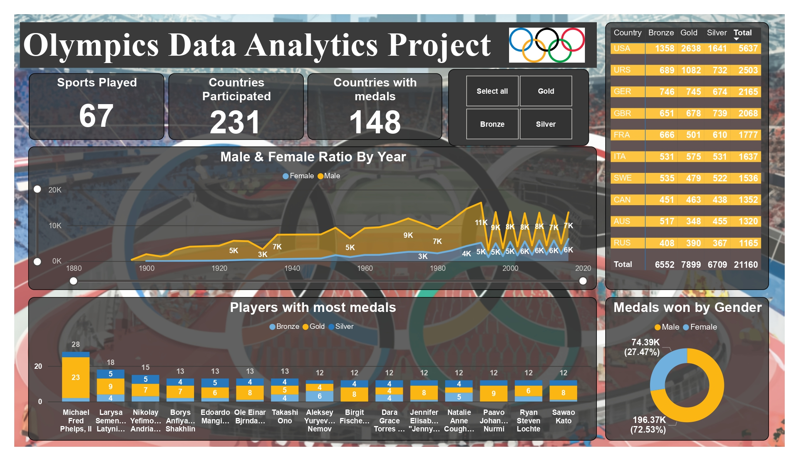

# Olympics Data Analytics Dashboard (Power BI)

## Project Overview

The **Olympics Data Analytics Dashboard** is an interactive **Power BI** project that provides comprehensive insights into historical Olympic Games data.  
This dashboard helps analyze **participation trends, medal distribution, gender ratio, and top-performing athletes and countries**.

The goal of this project is to transform raw Olympic data into meaningful visual insights for **data-driven decision making and sports analytics**.

---

## Objectives

- Analyze Olympic participation across years  
- Compare male and female participation trends  
- Identify top medal-winning athletes  
- Evaluate country-wise medal distribution  
- Understand gender-wise medal contribution  
- Provide interactive filtering for deeper analysis  

---

## Dashboard Features

### Key Metrics
- **Sports Played:** 67  
- **Countries Participated:** 231  
- **Countries with Medals:** 148  

---

## Visualizations Included

### 1️. Male & Female Ratio by Year
- Shows participation trends across years  
- Compares male vs female athletes  
- Identifies growth of women's participation over time  

### 2️. Players with Most Medals
- Top Olympic athletes  
- Medal distribution (Gold, Silver, Bronze)  
- Comparative analysis of top performers  

### 3️. Country-wise Medal Table
- Bronze, Silver, Gold count  
- Total medals per country  
- Highlights top-performing nations  

### 4️. Medals Won by Gender
- Gender-based medal distribution  
- Percentage comparison  
- Donut chart visualization  

---

## Interactive Filters

The dashboard includes dynamic filters:

- Select All  
- Gold  
- Silver  
- Bronze  

These filters allow users to:
- Focus on specific medal types  
- Perform detailed comparisons  
- Analyze trends dynamically  

---

## How to Use

1. Download the `.pbix` file  
2. Open using Power BI Desktop  
3. Use filters to explore insights  
4. Hover over visuals for detailed information  

---

## Dashboard Preview

---
